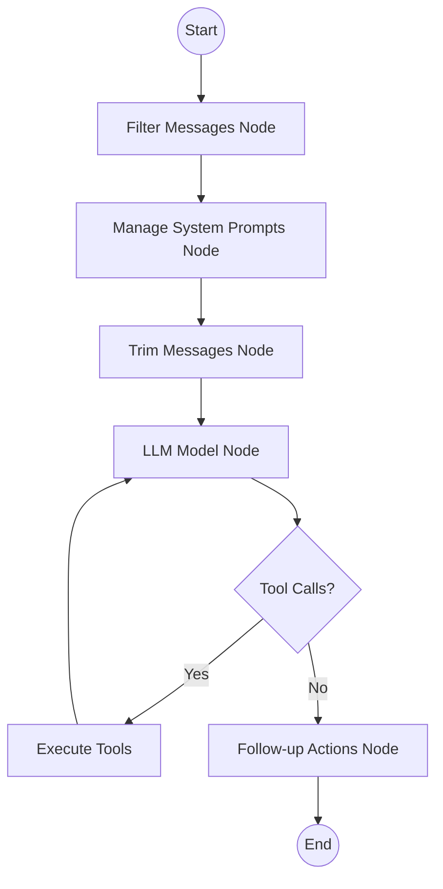
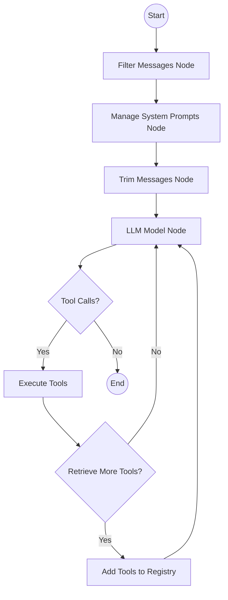
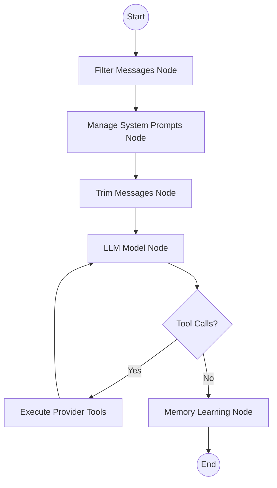

# LangGraph Architecture

GAIA uses **LangGraph** to build stateful, multi-actor agent systems. This page explains the graph structure, node types, and execution flow.

## What is LangGraph?

LangGraph is a framework for building cyclic computational graphs with LLMs. It enables:

- **Stateful execution**: Maintain conversation context across turns
- **Conditional routing**: Branch based on LLM outputs
- **Human-in-the-loop**: Pause for user confirmation
- **Persistence**: Save and restore graph state
- **Streaming**: Real-time output to users

## Graph Components

### Nodes

Nodes are functions that process state and produce outputs:

```python
from typing import Any
from app.agents.core.state import State

def my_node(state: State) -> dict[str, Any]:
    """Process state and return updates."""
    return {"messages": [AIMessage(content="Hello")]}
```

### Edges

Edges define the flow between nodes:

- **Normal edges**: Always follow the path
- **Conditional edges**: Branch based on state or outputs

### State

State is shared across all nodes in the graph:

```python
# Location: apps/api/app/agents/core/state.py:24
class State(DictLikeModel):
    query: str = ""
    messages: Annotated[List[AnyMessage], add_messages] = Field(default_factory=list)
    current_datetime: Optional[str] = None
    mem0_user_id: Optional[str] = None
    memories: List[str] = Field(default_factory=list)
    memories_stored: bool = False
    conversation_id: Optional[str] = None
```

## Agent Graph Structure

### Comms Agent Graph



The Comms Agent has limited tools:
- `call_executor`: Delegate to Executor Agent
- `add_memory`: Store user memories
- `search_memory`: Retrieve relevant memories

### Executor Agent Graph



The Executor Agent can:
- Execute any agent tool directly
- Dynamically retrieve new tools
- Delegate to specialized subagents via `handoff` tool

### Subagent Graph Structure



Subagents:
- Only have access to their provider's tools
- Use specialized system prompts
- Store procedural memories via `memory_learning_node`

## Node Hooks

GAIA uses pre-model and post-model hooks to modify agent behavior:

### Pre-Model Hooks

Executed before the LLM is invoked:

#### Filter Messages Node

```python
# Location: apps/api/app/agents/core/nodes/filter_messages.py:13
def filter_messages_node(state: State) -> dict:
    """
    Filter and transform messages before sending to LLM.
    Removes excessively large messages and cleans content.
    """
    filtered_messages = []
    for msg in state.messages:
        # Filter logic...
        filtered_messages.append(msg)
    
    return {"messages": filtered_messages}
```

#### Manage System Prompts Node

```python
# Location: apps/api/app/agents/core/nodes/manage_system_prompts.py
def manage_system_prompts_node(state: State) -> dict:
    """
    Inject or update system prompts with context:
    - Current datetime
    - User timezone
    - Retrieved memories
    - Selected tools or workflows
    """
    system_prompt = build_system_prompt(
        current_datetime=state.current_datetime,
        memories=state.memories,
    )
    
    return {"messages": [SystemMessage(content=system_prompt)]}
```

#### Trim Messages Node

```python
# Location: apps/api/app/agents/core/nodes/trim_messages_node.py
def trim_messages_node(state: State) -> dict:
    """
    Trim message history to fit context window.
    Keeps recent messages and important context.
    """
    trimmed = trim_messages(
        state.messages,
        max_tokens=100000,
        strategy="last",
    )
    
    return {"messages": trimmed}
```

### End-Graph Hooks

Executed after agent completes its task:

#### Follow-up Actions Node

```python
# Location: apps/api/app/agents/core/nodes/follow_up_actions_node.py
async def follow_up_actions_node(state: State) -> dict:
    """
    Generate proactive follow-up suggestions based on conversation.
    Uses free LLM (Gemini 2.0 Flash) for cost efficiency.
    """
    last_ai_message = get_last_ai_message(state.messages)
    
    followup_suggestions = await generate_followups(
        conversation=last_ai_message,
        user_id=state.mem0_user_id,
    )
    
    # Stream to frontend
    writer({
        "follow_up_actions": followup_suggestions
    })
    
    return {}
```

#### Memory Learning Node

```python
# Location: apps/api/app/agents/core/nodes/memory_learning_node.py
async def memory_learning_node(state: State) -> dict:
    """
    Store procedural knowledge for agents (skills/patterns).
    Subagents use this to learn task-specific approaches.
    """
    agent_name = config.get("configurable", {}).get("agent_name")
    
    # Extract learnings from conversation
    skill_memory = await extract_procedural_knowledge(
        messages=state.messages,
        agent_name=agent_name,
    )
    
    # Store in agent-specific namespace
    await memory_service.store_memory(
        message=skill_memory,
        user_id=f"agent:{agent_name}",
        metadata={"type": "skill"},
    )
    
    return {}
```

## Agent Compilation

Agents are compiled with checkpointers and stores:

```python
# Location: apps/api/app/agents/core/graph_builder/build_graph.py:59
checkpointer_manager = await get_checkpointer_manager()

if in_memory_checkpointer or not checkpointer_manager:
    in_memory_checkpointer_instance = InMemorySaver()
    graph = builder.compile(
        checkpointer=in_memory_checkpointer_instance,
        store=store
    )
else:
    postgres_checkpointer = checkpointer_manager.get_checkpointer()
    graph = builder.compile(
        checkpointer=postgres_checkpointer,
        store=store
    )
```

### Checkpointers

Checkpointers save agent state for resumption:

- **InMemorySaver**: For testing and ephemeral conversations
- **PostgresSaver**: For production state persistence

```python
# Location: apps/api/app/agents/core/graph_builder/checkpointer_manager.py:13
class CheckpointerManager:
    def __init__(self, pool):
        self.pool = pool
    
    def get_checkpointer(self):
        """Get PostgreSQL checkpointer for state persistence."""
        from langgraph.checkpoint.postgres import PostgresSaver
        return PostgresSaver(pool=self.pool)
```

### Stores

Stores provide shared key-value storage across graph invocations:

```python
# Location: apps/api/app/agents/tools/core/store.py
async def get_tools_store():
    """Get LangGraph store for shared state."""
    from langgraph.store.postgres import PostgresStore
    return PostgresStore(pool=db.get_pg_pool())
```

## Subagent Creation

Subagents are created using the factory pattern:

```python
# Location: apps/api/app/agents/core/subagents/base_subagent.py:39
class SubAgentFactory:
    @staticmethod
    async def create_provider_subagent(
        provider: str,
        name: str,
        llm: LanguageModelLike,
        tool_space: str = "general",
        use_direct_tools: bool = False,
        disable_retrieve_tools: bool = False,
    ):
        """
        Creates a specialized sub-agent graph for a specific provider.
        
        Args:
            provider: Provider name (gmail, notion, twitter, etc.)
            name: Agent name for identification
            llm: Language model to use
            tool_space: Tool space for scoped tool retrieval
            use_direct_tools: Bind tools directly vs. dynamic retrieval
            disable_retrieve_tools: Disable tool retrieval entirely
        
        Returns:
            Compiled LangGraph agent with checkpointer
        """
        tool_registry = await get_tool_registry()
        store = await get_tools_store()
        
        # Get scoped tools for this provider
        scoped_tool_dict = {}
        initial_tool_ids = []
        
        category = tool_registry.get_category_by_space(tool_space)
        if category:
            for t in category.tools:
                scoped_tool_dict[t.name] = t.tool
                initial_tool_ids.append(t.name)
        
        # Always add search_memory for user context
        scoped_tool_dict[search_memory.name] = search_memory
        
        builder = create_agent(
            llm=llm,
            agent_name=name,
            tool_registry=scoped_tool_dict,
            initial_tool_ids=initial_tool_ids,
            pre_model_hooks=[
                filter_messages_node,
                manage_system_prompts_node,
                trim_messages_node,
            ],
            end_graph_hooks=[memory_learning_node],
        )
        
        checkpointer = await get_or_create_checkpointer(provider)
        
        return builder.compile(
            store=store,
            name=name,
            checkpointer=checkpointer
        )
```

## Handoff Pattern

The executor delegates to subagents using the `handoff` tool:

```python
# Location: apps/api/app/agents/core/subagents/handoff_tools.py
@tool
async def handoff(
    provider: str,
    task: str,
    config: RunnableConfig,
) -> str:
    """
    Delegate task to a specialized provider subagent.
    
    Args:
        provider: Provider name (gmail, notion, calendar, etc.)
        task: Detailed task description for the subagent
        config: Runtime configuration with user context
    
    Returns:
        Subagent execution summary
    """
    # Get or create subagent for provider
    subagent = await get_subagent(provider)
    
    # Build subagent config with specialized prompt
    subagent_config = build_subagent_config(
        provider=provider,
        parent_config=config,
    )
    
    # Invoke subagent
    result = await subagent.ainvoke(
        {"messages": [HumanMessage(content=task)]},
        config=subagent_config,
    )
    
    return extract_summary(result)
```

<Tip>
Subagents use specialized system prompts (see `/agents/llm/prompts`) that give them deep domain expertise. For example, the Gmail agent knows to use search tools persistently when email details are ambiguous.
</Tip>

## Graph Visualization

LangGraph provides built-in visualization:

```python
from langgraph.graph import StateGraph

graph = await build_comms_graph()

# Generate Mermaid diagram
print(graph.get_graph().draw_mermaid())

# Or use built-in visualizer
graph.get_graph().draw_png("agent_graph.png")
```

<Note>
GAIA uses a custom `create_agent` function (from `app.override.langgraph_bigtool.create_agent`) that extends LangGraph's built-in agent creation with support for dynamic tool retrieval and hook systems.
</Note>

## Next Steps

- [State Management](/agents/state-management) - Learn about state schemas
- [Graph Manager](/agents/graph-manager) - Understand graph lifecycle
- [Agent Tools](/agents/tools/calendar) - Explore tool integrations
- [LLM Prompts](/agents/llm/prompts) - See system prompt templates