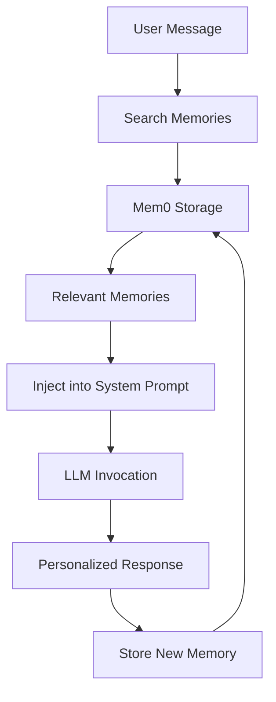

# Memory Integration

GAIA integrates **Mem0** memories into LLM context, enabling personalized, context-aware AI interactions.

## Architecture



## Memory Flow

### 1. Message Reception

```python
# Location: apps/api/app/agents/core/agent.py:95
async def _core_agent_logic(...):
    user_id = user.get("user_id")
    
    # Background memory storage (fire and forget)
    if user_id and request.message:
        task = asyncio.create_task(
            store_user_message_memory(
                user_id,
                request.message,
                conversation_id
            )
        )
        _background_tasks.add(task)
        task.add_done_callback(_background_tasks.discard)
```

### 2. Memory Search

```python
# Search for relevant memories
memories = await memory_service.search_memories(
    query=request.message,
    user_id=user_id,
    limit=5
)

# Extract content
memory_list = [m.content for m in memories.memories]

# Add to state
initial_state = {
    "query": request.message,
    "messages": history,
    "memories": memory_list,
    "mem0_user_id": user_id,
}
```

### 3. Context Injection

```python
# Location: apps/api/app/agents/core/nodes/manage_system_prompts_node.py
def manage_system_prompts_node(state: State, config: RunnableConfig) -> dict:
    """
    Inject memories into system prompt.
    """
    memories = state.memories
    
    if not memories:
        return {"messages": [SystemMessage(content=base_prompt)]}
    
    # Format memories for context
    memory_context = "\n".join([
        f"- {memory}" for memory in memories
    ])
    
    enhanced_prompt = f"""
{base_prompt}

RELEVANT CONTEXT FROM PREVIOUS INTERACTIONS:
{memory_context}

Use this context to personalize your responses and avoid asking for information the user has already provided.
"""
    
    return {"messages": [SystemMessage(content=enhanced_prompt)]}
```

### 4. LLM Processing

LLM receives messages with memory-enhanced prompt:

```python
messages = [
    SystemMessage(content="You are an AI assistant.\n\nRELEVANT CONTEXT:\n- User works at Acme Corp\n- User's manager is John Smith\n..."),
    HumanMessage(content="Email my manager about the project"),
]

response = await llm.ainvoke(messages)
# LLM knows manager is John Smith, can find email from memories
```

### 5. Memory Extraction

```python
# Location: apps/api/app/agents/core/nodes/memory_learning_node.py
async def memory_learning_node(state: State, config: RunnableConfig) -> dict:
    """
    Extract and store new memories from conversation.
    """
    agent_name = config.get("configurable", {}).get("agent_name")
    messages = state.messages
    
    # Extract learnings
    learnings = await extract_memories_from_conversation(
        messages=messages,
        agent_name=agent_name,
    )
    
    # Store procedural knowledge for agent
    if agent_name and "subagent" in agent_name:
        for learning in learnings:
            await memory_service.store_memory(
                message=learning,
                user_id=f"agent:{agent_name}",
                metadata={"type": "skill"},
                async_mode=True,
            )
    
    return {}
```

## Memory Types in Context

### User Memories

**Stored**: User preferences, contacts, context

**Usage**: Personalize responses, avoid repetition

```python
# Example memory retrieval
query = "Who should I email about the budget?"
memories = await search_memory(query, user_id)

# Retrieved:
# - "User's finance lead is Sarah Chen (sarah@company.com)"
# - "User is working on Q4 budget project"

# LLM response:
# "I'll email Sarah Chen about the Q4 budget project."
```

### Agent Skills

**Stored**: Procedural knowledge, successful patterns

**Usage**: Improve future task execution

```python
# Gmail subagent stores successful search pattern
await memory_service.store_memory(
    message="Searching with 'sender:email' syntax finds emails more accurately than just names",
    user_id="agent:gmail_subagent",
    metadata={"type": "skill", "category": "search"},
)

# Future Gmail searches use this knowledge
memories = await search_memory("email search best practices", "agent:gmail_subagent")
# Retrieves: "Use sender: syntax..."
# Agent applies this in next search
```

## Memory Namespaces

```python
# User namespace: "user:{user_id}"
user_memories = await search_memory(
    "project preferences",
    user_id="user:abc123"
)

# Agent namespace: "agent:{agent_name}"
agent_memories = await search_memory(
    "search patterns",
    user_id="agent:gmail_subagent"
)

# Namespaces are isolated
# User memories != Agent memories
```

## Memory Search Strategies

### Semantic Search

```python
# Mem0 uses embeddings for semantic similarity
await search_memory(
    query="who handles finance",
    user_id=user_id,
    limit=3
)

# Matches:
# - "Sarah Chen is the CFO"
# - "Finance team lead: Sarah Chen"
# - "Contact Sarah for budget questions"
```

### Context-Aware Retrieval

```python
# Search considers conversation context
state["query"] = "Email the engineering lead"

memories = await memory_service.search_memories(
    query=state["query"],
    user_id=user_id,
    limit=5
)

# Retrieved memories:
# - "Engineering lead: Alice Johnson (alice@company.com)"
# - "Alice prefers Slack over email for urgent matters"
# - "Alice's team: Backend, Frontend, DevOps"
```

## Memory Limits

### Token Budget

Limit memories to avoid context overflow:

```python
MAX_MEMORY_TOKENS = 1000  # Reserve for memories

async def get_memories_within_budget(
    query: str,
    user_id: str,
    max_tokens: int = MAX_MEMORY_TOKENS,
) -> List[str]:
    """
    Retrieve memories up to token limit.
    """
    memories = await search_memory(query, user_id, limit=20)
    
    selected = []
    total_tokens = 0
    
    for memory in memories:
        tokens = count_tokens(memory)
        if total_tokens + tokens <= max_tokens:
            selected.append(memory)
            total_tokens += tokens
        else:
            break
    
    return selected
```

### Relevance Filtering

Only include high-relevance memories:

```python
MIN_RELEVANCE_SCORE = 0.7

memories = await search_memory(query, user_id, limit=10)
relevant = [
    m.content for m in memories
    if m.relevance_score >= MIN_RELEVANCE_SCORE
]
```

## Async Memory Storage

Memories stored asynchronously for performance:

```python
# Fire-and-forget pattern
task = asyncio.create_task(
    memory_service.store_memory(
        message="User prefers afternoon meetings",
        user_id=user_id,
        async_mode=True,
    )
)

# Track background tasks
_background_tasks.add(task)
task.add_done_callback(_background_tasks.discard)

# Agent doesn't wait for storage to complete
```

**Benefits:**
- Faster response times
- Non-blocking operations
- Better user experience

## Memory Extraction Prompts

Specialized prompts guide memory extraction:

```python
# Location: apps/api/app/agents/prompts/memory_prompts.py:20
MEMORY_EXTRACTION_PROMPT = """
Extract CRITICAL REUSABLE INFORMATION from this conversation.

PRIORITY 1 - IDENTITY MAPPINGS:
- "John Smith's email is john@company.com"
- "Project Alpha ID: PROJ-123"

PRIORITY 2 - CONTACT DIRECTORY:
- "Sarah Chen, Engineering Manager, sarah@company.com"

PRIORITY 3 - PREFERENCES:
- "User prefers Slack over email"
- "User's timezone: America/New_York"

Extract as bullet points.
"""

# LLM processes conversation and returns structured memories
memories = await llm.ainvoke([
    SystemMessage(content=MEMORY_EXTRACTION_PROMPT),
    HumanMessage(content=format_conversation(messages)),
])
```

## Testing Memory Integration

### Unit Tests

```python
import pytest
from app.agents.tools.memory_tools import search_memory, add_memory

@pytest.mark.asyncio
async def test_memory_storage_and_retrieval():
    """Test memory storage and semantic search."""
    config = {"metadata": {"user_id": "test_user"}}
    
    # Store memory
    result = await add_memory(
        config,
        content="John Smith is the engineering lead at Acme Corp",
    )
    assert "successfully" in result.lower()
    
    # Search memory
    memories = await search_memory(
        config,
        query="who is the engineering lead",
        limit=3
    )
    assert "John Smith" in memories
    assert "Acme Corp" in memories
```

### Integration Tests

```python
@pytest.mark.asyncio
async def test_memory_in_agent_context():
    """Test memories injected into agent context."""
    # Store memory
    await add_memory(
        config,
        content="User's manager is Alice Johnson (alice@company.com)",
    )
    
    # Send message
    response = await call_agent(
        request=MessageRequestWithHistory(
            message="Email my manager about the project",
        ),
        conversation_id="test_thread",
        user={"user_id": "test_user"},
        user_time=datetime.now(),
    )
    
    # Verify agent used memory
    assert "alice@company.com" in response.lower()
```

## Best Practices

### 1. Store Actionable Information

```python
# Good: Specific, reusable
await add_memory(config, "User's GitHub username: @johndoe")

# Avoid: Vague, unusable
await add_memory(config, "User mentioned GitHub")
```

### 2. Use Background Storage

```python
# Good: Non-blocking
task = asyncio.create_task(store_memory(...))
_background_tasks.add(task)

# Avoid: Blocking
await store_memory(...)  # Slows down response
```

### 3. Limit Context Size

```python
# Good: Bounded memory retrieval
memories = await search_memory(query, user_id, limit=5)

# Avoid: Unbounded
memories = await search_memory(query, user_id, limit=100)  # Too many
```

### 4. Filter by Relevance

```python
# Good: High-relevance only
relevant = [m for m in memories if m.relevance_score >= 0.7]

# Avoid: Including low-relevance
all_memories = [m for m in memories]  # Adds noise
```

<Note>
Memories are stored asynchronously by default. The agent continues processing without waiting for Mem0 API calls, improving response times.
</Note>

## Next Steps

- [Memory Tool](/agents/tools/memory) - Memory storage API
- [LLM Prompts](/agents/llm/prompts) - Prompt engineering
- [State Management](/agents/state-management) - Agent state
- [LLM Providers](/agents/llm/providers) - Model configuration