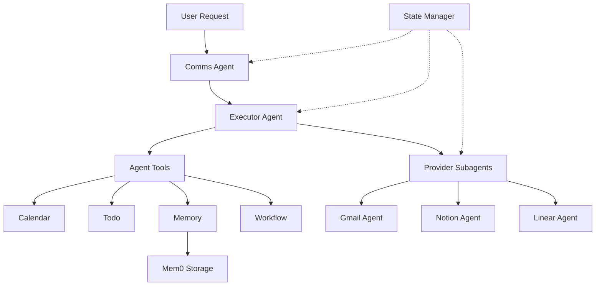
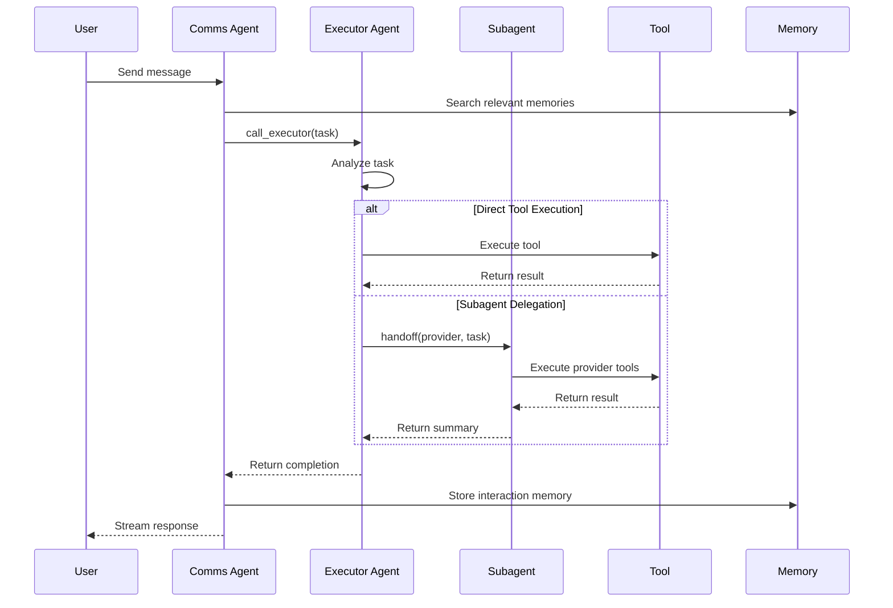

# Agent System Overview

GAIA's agent system is built on **LangGraph**, a framework for creating stateful, multi-actor applications with LLMs. The architecture enables sophisticated task delegation, memory integration, and tool orchestration.

## Architecture Components

The agent system consists of several key components:



## Core Agents

### Comms Agent

The **Comms Agent** is the primary interface for user interactions. It handles:

- User message processing
- Memory storage and retrieval
- Delegation to the Executor Agent
- Follow-up action generation
- Response streaming to frontend

```python
# Location: apps/api/app/agents/core/graph_builder/build_graph.py:91
async def build_comms_graph(
    chat_llm: Optional[LanguageModelLike] = None,
    in_memory_checkpointer: bool = False,
):
    """Build the comms agent graph with only the executor tool."""
    if chat_llm is None:
        chat_llm = init_llm()

    tool_registry = {
        "call_executor": call_executor,
        "add_memory": memory_tools.add_memory,
        "search_memory": memory_tools.search_memory,
    }
    store = await get_tools_store()

    builder = create_agent(
        llm=chat_llm,
        agent_name="comms_agent",
        tool_registry=tool_registry,
        disable_retrieve_tools=True,
        initial_tool_ids=["call_executor", "add_memory", "search_memory"],
        pre_model_hooks=[
            filter_messages_node,
            manage_system_prompts_node,
            trim_messages_node,
        ],
        end_graph_hooks=[
            follow_up_actions_node,
        ],
    )
```

### Executor Agent

The **Executor Agent** has access to all agent tools and handles complex task execution:

- Direct tool execution (Calendar, Todo, Email, etc.)
- Subagent delegation for specialized tasks
- Workflow creation and management
- Code execution in sandboxes
- Integration management

```python
# Location: apps/api/app/agents/core/graph_builder/build_graph.py:30
async def build_executor_graph(
    chat_llm: Optional[LanguageModelLike] = None,
    in_memory_checkpointer: bool = False,
):
    """Construct and compile the executor agent graph with handoff tools."""
    if chat_llm is None:
        chat_llm = init_llm()

    tool_registry, store = await asyncio.gather(
        get_tool_registry(),
        get_tools_store(),
    )

    tool_dict = tool_registry.get_tool_dict()
    tool_dict.update({"handoff": handoff_tool})

    builder = create_agent(
        llm=chat_llm,
        agent_name="executor_agent",
        tool_registry=tool_dict,
        retrieve_tools_coroutine=get_retrieve_tools_function(),
        initial_tool_ids=["handoff"],
        pre_model_hooks=[
            filter_messages_node,
            manage_system_prompts_node,
            trim_messages_node,
        ],
    )
```

### Provider Subagents

**Provider Subagents** are specialized agents with deep expertise in specific integrations:

- **Gmail Agent**: Email operations and inbox management
- **Notion Agent**: Note-taking and database management
- **Linear Agent**: Issue tracking and project management
- **Calendar Agent**: Event scheduling and management
- **Twitter/LinkedIn Agents**: Social media interactions

Each subagent:
- Has its own tool registry scoped to its provider
- Uses specialized system prompts for domain expertise
- Can store procedural memories ("skills") specific to the agent
- Accesses user memories for personalization

## Agent Invocation Flow



## Execution Modes

The agent system supports two execution patterns:

### Streaming Mode

For interactive chat and real-time user interactions:

```python
# Location: apps/api/app/agents/core/agent.py:117
async def call_agent(
    request: MessageRequestWithHistory,
    conversation_id: str,
    user: dict,
    user_time: datetime,
    user_model_config: Optional[ModelConfig] = None,
    usage_metadata_callback: Optional[UsageMetadataCallbackHandler] = None,
    stream_id: Optional[str] = None,
) -> AsyncGenerator[str, None]:
    """
    Execute agent in streaming mode for interactive chat.
    
    Returns an AsyncGenerator that yields SSE-formatted streaming data.
    """
    graph, initial_state, config = await _core_agent_logic(
        request, conversation_id, user, user_time,
        user_model_config, usage_metadata_callback
    )
    
    if stream_id:
        config["configurable"]["stream_id"] = stream_id
    
    return execute_graph_streaming(graph, initial_state, config)
```

### Silent Mode

For background processing, workflows, and batch operations:

```python
# Location: apps/api/app/agents/core/agent.py:163
async def call_agent_silent(
    request: MessageRequestWithHistory,
    conversation_id: str,
    user: dict,
    user_time: datetime,
    usage_metadata_callback: Optional[UsageMetadataCallbackHandler] = None,
    user_model_config: Optional[ModelConfig] = None,
    trigger_context: Optional[dict] = None,
) -> tuple[str, dict]:
    """
    Execute agent in silent mode for background processing.
    
    Returns a tuple of (complete_message, tool_data_dict).
    """
    graph, initial_state, config = await _core_agent_logic(
        request, conversation_id, user, user_time,
        user_model_config, trigger_context,
        usage_metadata_callback
    )
    
    return await execute_graph_silent(graph, initial_state, config)
```

## Key Features

### Dynamic Tool Retrieval

Agents can dynamically retrieve tools based on context:

```python
# Location: apps/api/app/agents/tools/core/retrieval.py
async def retrieve_tools(
    task: str,
    tool_space: str = "general",
    include_subagents: bool = True,
) -> list[str]:
    """
    Retrieve relevant tool IDs based on task description.
    Uses semantic search against tool descriptions.
    """
```

### State Persistence

Agent state is persisted using PostgreSQL checkpointers:

```python
# Location: apps/api/app/agents/core/graph_builder/checkpointer_manager.py
class CheckpointerManager:
    async def get_checkpointer(self):
        """Get PostgreSQL checkpointer for state persistence."""
        return PostgresSaver(pool=self.pool)
```

### Memory Integration

All agents have access to user and agent-specific memories via Mem0:

- **User memories**: Stored per user (preferences, contacts, IDs)
- **Agent skills**: Stored per agent (procedural knowledge)

<Note>
The agent system uses a lazy provider pattern to initialize components on-demand, reducing startup time and memory usage.
</Note>

## Next Steps

- [LangGraph Architecture](/agents/langgraph-architecture) - Dive into the graph structure
- [State Management](/agents/state-management) - Learn about state schemas
- [Agent Tools](/agents/tools/calendar) - Explore available tools
- [LLM Integration](/agents/llm/providers) - Configure language models