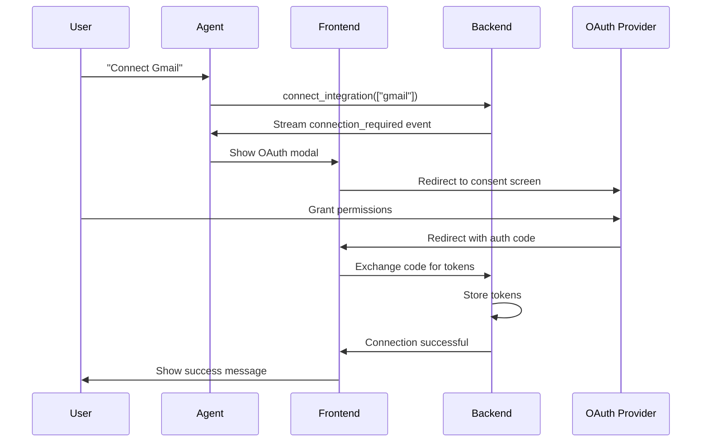

# Integration Tool

The Integration tool manages user connections to third-party services and enables discovery of public integrations from the marketplace.

## Overview

Integration capabilities:

- List connected integrations
- Search public marketplace integrations
- Initiate OAuth connections
- Check integration status
- Manage custom MCP integrations

```python
# Location: apps/api/app/agents/tools/integration_tool.py
```

## Available Tools

### List Integrations

```python
@tool
@with_doc(LIST_INTEGRATIONS)
async def list_integrations(
    config: RunnableConfig,
    search_public_query: Annotated[
        Optional[str],
        "Search query to discover public integrations from marketplace"
    ] = None,
) -> ListIntegrationsResult | str:
    """
    List user integrations and optionally search for suggested public integrations.
    
    Returns structured data for LLM context and streams suggested integrations
    to the frontend for the 'Discover More' section.
    
    Args:
        config: Runtime configuration with user_id
        search_public_query: Natural language search (e.g., "email automation")
    
    Returns:
        {
            "connected": [{"id": "gmail", "name": "Gmail", ...}],
            "available": [{"id": "notion", "name": "Notion", ...}],
            "suggested": [{"id": "zapier", "name": "Zapier", ...}]
        }
    """
    user_id = config.get("configurable", {}).get("user_id")
    if not user_id:
        return "Error: User ID not found in configuration."
    
    writer = get_stream_writer()
    
    # Fetch platform integrations with connection status
    platform_ids = [i.id for i in OAUTH_INTEGRATIONS if i.available]
    status_map = await check_multiple_integrations_status(platform_ids, user_id)
    
    connected_list = []
    available_list = []
    
    for integration in OAUTH_INTEGRATIONS:
        if not integration.available:
            continue
        
        is_connected = status_map.get(integration.id, False)
        info = {
            "id": integration.id,
            "name": integration.name,
            "description": integration.description,
            "category": integration.category,
            "connected": is_connected,
        }
        
        if is_connected:
            connected_list.append(info)
        else:
            available_list.append(info)
    
    # Search for suggested public integrations
    suggested_list = []
    
    if search_public_query and search_public_query.strip():
        query = search_public_query.strip()
        logger.info(f"Searching public integrations with query: {query}")
        
        # Get IDs to exclude
        existing_ids = {i["id"] for i in connected_list + available_list}
        
        # Build flexible word-based search
        words = build_search_patterns(query)
        
        # MongoDB regex search
        word_conditions = []
        for word in words:
            escaped_word = re.escape(word)
            word_conditions.extend([
                {"name": {"$regex": escaped_word, "$options": "i"}},
                {"description": {"$regex": escaped_word, "$options": "i"}},
                {"category": {"$regex": escaped_word, "$options": "i"}},
            ])
        
        search_filter = {
            "is_public": True,
            "integration_id": {"$nin": list(existing_ids)},
            "$or": word_conditions
        }
        
        docs_cursor = integrations_collection.find(search_filter).limit(MAX_SUGGESTED_FOR_LLM)
        
        async for doc in docs_cursor:
            iid = doc.get("integration_id")
            suggested_list.append({
                "id": iid,
                "name": doc.get("name", ""),
                "description": doc.get("description", ""),
                "category": doc.get("category", "custom"),
                "icon_url": doc.get("icon_url"),
                "auth_type": doc.get("mcp_config", {}).get("auth_type"),
                "relevance_score": 1.0,
                "slug": generate_integration_slug(
                    name=doc.get("name", ""),
                    category=doc.get("category", "custom"),
                    integration_id=iid,
                ),
            })
    
    # Stream suggested integrations to frontend
    if suggested_list:
        writer({
            "integration_list_data": {
                "hasSuggestions": True,
                "suggested": suggested_list[:MAX_SUGGESTED_FOR_LLM],
            }
        })
    
    # Return structured data for LLM (with limits)
    return {
        "connected": connected_list[:MAX_CONNECTED_FOR_LLM],
        "available": available_list[:MAX_AVAILABLE_FOR_LLM],
        "suggested": suggested_list[:MAX_SUGGESTED_FOR_LLM],
    }
```

**Usage:**
```python
# List user's current integrations
result = await list_integrations(config)

# Search marketplace for new integrations
result = await list_integrations(
    config,
    search_public_query="project management tools"
)
```

### Suggest Integrations

```python
@tool
async def suggest_integrations(
    query: Annotated[
        str,
        "Search query to find relevant public integrations"
    ],
    config: RunnableConfig,
) -> ListIntegrationsResult | str:
    """
    Search for and suggest public integrations from the marketplace.
    
    Use when user wants to discover new integrations, find alternatives,
    or explore what's available in a specific category.
    
    Examples:
    - "email tools"
    - "project management"
    - "social media"
    - "CRM systems"
    - "Slack alternatives"
    """
    return await list_integrations.ainvoke(
        {"search_public_query": query},
        config=config
    )
```

### Connect Integration

```python
@tool
@with_doc(CONNECT_INTEGRATION)
async def connect_integration(
    integration_names: Annotated[
        List[str],
        "List of integration names or IDs to connect"
    ],
    config: RunnableConfig,
) -> str:
    """
    Initiate OAuth connection flow for integrations.
    
    Args:
        integration_names: List like ['gmail', 'notion', 'twitter']
        config: Runtime configuration
    
    Returns:
        Status message for each integration
    """
    user_id = config.get("configurable", {}).get("user_id")
    if not user_id:
        return "Error: User ID not found in configuration."
    
    # Ensure list format
    if isinstance(integration_names, str):
        integration_names = [integration_names]
    
    writer = get_stream_writer()
    results = []
    connections_to_initiate = []
    
    for integration_name in integration_names:
        # Find integration by name or ID
        integration = None
        search_name = integration_name.lower().strip()
        
        for integ in OAUTH_INTEGRATIONS:
            if (
                integ.id.lower() == search_name
                or integ.name.lower() == search_name
                or (integ.short_name and integ.short_name.lower() == search_name)
            ):
                integration = integ
                break
        
        if not integration:
            available = [i.name for i in OAUTH_INTEGRATIONS if i.available]
            results.append(
                f"❌ '{integration_name}' not found. "
                f"Available: {', '.join(available[:5])}..."
            )
            continue
        
        if not integration.available:
            results.append(f"⏳ {integration.name} is not available yet. Coming soon!")
            continue
        
        # Check if already connected
        is_connected = await check_single_integration_status(integration.id, user_id)
        if is_connected:
            results.append(f"✅ {integration.name} is already connected!")
            continue
        
        # Queue for connection
        connections_to_initiate.append(integration)
    
    # Initiate connections
    for integration in connections_to_initiate:
        writer({"progress": f"Initiating {integration.name} connection..."})
        
        integration_data = {
            "integration_id": integration.id,
            "message": f"To use {integration.name} features, please connect your account.",
        }
        
        writer({"integration_connection_required": integration_data})
        
        results.append(
            f"🔗 Connection initiated for {integration.name}. "
            f"Please follow the authentication flow."
        )
    
    return "\n".join(results) if results else "No integrations to connect."
```

**Usage:**
```python
# Connect single integration
await connect_integration(["gmail"], config)

# Connect multiple integrations
await connect_integration(["gmail", "notion", "calendar"], config)
```

### Check Integration Status

```python
@tool
@with_doc(CHECK_INTEGRATIONS_STATUS)
async def check_integrations_status(
    integration_names: Annotated[
        List[str],
        "List of integration names or IDs to check"
    ],
    config: RunnableConfig,
) -> str:
    """
    Check connection status for multiple integrations.
    
    Args:
        integration_names: List like ['gmail', 'notion']
        config: Runtime configuration
    
    Returns:
        Status summary for each integration
    """
    user_id = config.get("configurable", {}).get("user_id")
    if not user_id:
        return "Error: User ID not found in configuration."
    
    results = []
    
    for integration_name in integration_names:
        search_name = integration_name.lower().strip()
        integration = None
        
        for integ in OAUTH_INTEGRATIONS:
            if (
                integ.id.lower() == search_name
                or integ.name.lower() == search_name
                or (integ.short_name and integ.short_name.lower() == search_name)
            ):
                integration = integ
                break
        
        if not integration:
            results.append(f"❓ {integration_name}: Not found")
            continue
        
        # Check status
        is_connected = await check_single_integration_status(integration.id, user_id)
        status = "✅ Connected" if is_connected else "⚪ Not Connected"
        results.append(f"{integration.name}: {status}")
    
    return "\n".join(results)
```

## OAuth Configuration

```python
# Location: apps/api/app/config/oauth_config.py
from pydantic import BaseModel

class OAuthIntegration(BaseModel):
    id: str
    name: str
    short_name: Optional[str]
    description: str
    category: str
    available: bool
    scopes: List[str]
    authorization_url: str
    token_url: str

OAUTH_INTEGRATIONS = [
    OAuthIntegration(
        id="gmail",
        name="Gmail",
        short_name="gmail",
        description="Email management and automation",
        category="communication",
        available=True,
        scopes=["https://www.googleapis.com/auth/gmail.modify"],
        authorization_url="https://accounts.google.com/o/oauth2/v2/auth",
        token_url="https://oauth2.googleapis.com/token",
    ),
    # ... more integrations
]
```

## Integration Status Checking

```python
# Location: apps/api/app/services/oauth/oauth_service.py
async def check_integration_status(
    integration_id: str,
    user_id: str,
) -> bool:
    """
    Check if user has connected an integration.
    
    Args:
        integration_id: Integration identifier
        user_id: User identifier
    
    Returns:
        True if connected and valid, False otherwise
    """
    # Check database for OAuth tokens
    user_integration = await user_integrations_collection.find_one({
        "user_id": user_id,
        "integration_id": integration_id,
    })
    
    if not user_integration:
        return False
    
    # Check token validity
    if user_integration.get("status") == "connected":
        # Verify token hasn't expired
        expires_at = user_integration.get("expires_at")
        if expires_at and datetime.now() < expires_at:
            return True
        
        # Try to refresh token
        refreshed = await refresh_oauth_token(user_integration)
        return refreshed
    
    return False

async def check_multiple_integrations_status(
    integration_ids: List[str],
    user_id: str,
) -> Dict[str, bool]:
    """
    Batch check integration status for efficiency.
    
    Returns:
        {"gmail": True, "notion": False, ...}
    """
    # Batch query
    cursor = user_integrations_collection.find({
        "user_id": user_id,
        "integration_id": {"$in": integration_ids},
    })
    
    status_map = {iid: False for iid in integration_ids}
    
    async for doc in cursor:
        integration_id = doc["integration_id"]
        is_connected = doc.get("status") == "connected"
        status_map[integration_id] = is_connected
    
    return status_map
```

## Search Patterns

```python
SEARCH_STOPWORDS = {
    "a", "an", "the", "to", "for", "with",
    "and", "or", "in", "on", "my"
}

def build_search_patterns(query: str) -> list[str]:
    """
    Extract individual words from query for flexible matching.
    
    Example:
        "Render deployment" -> ["render", "deployment"]
    
    This allows matching "Render" when query is "Render deployment"
    """
    words = re.split(r"[\s,;]+", query.lower())
    return [w for w in words if len(w) >= 2 and w not in SEARCH_STOPWORDS]
```

## Frontend Integration Flow



## Custom MCP Integrations

Users can add custom MCP (Model Context Protocol) servers:

```python
# Custom integration stored in MongoDB
{
    "integration_id": "custom_api_123",
    "name": "My Custom API",
    "description": "Internal company API",
    "category": "custom",
    "source": "custom",
    "mcp_config": {
        "command": "node",
        "args": ["/path/to/server.js"],
        "env": {"API_KEY": "..."},
        "auth_type": "api_key"
    },
    "is_public": False,
    "created_by": "user_123"
}
```

## Usage Examples

### Discovering Integrations

```python
# User: "What CRM tools are available?"
await suggest_integrations(
    query="CRM systems",
    config=config
)
# Returns: Salesforce, HubSpot, Pipedrive, etc.
```

### Checking Before Tool Use

```python
# Before using Gmail tool
is_connected = await check_integrations_status(["gmail"], config)

if "Not Connected" in is_connected:
    # Prompt user to connect
    await connect_integration(["gmail"], config)
else:
    # Proceed with Gmail operation
    await send_email(...)
```

<Note>
Integration search uses flexible word-based matching with MongoDB regex, making it resilient to typos and variations in search queries.
</Note>

## Best Practices

### 1. Check Status Before Operations

```python
# Good: Check first
status = await check_integrations_status(["notion"], config)
if "Connected" in status:
    await notion_operation()

# Avoid: Assume connection
await notion_operation()  # May fail if not connected
```

### 2. Batch Status Checks

```python
# Good: Single batch check
status_map = await check_multiple_integrations_status(
    ["gmail", "calendar", "notion"],
    user_id
)

# Avoid: Multiple individual checks
for integration in ["gmail", "calendar", "notion"]:
    await check_integration_status(integration, user_id)
```

### 3. Provide Context in Search

```python
# Good: Specific search
await suggest_integrations("project management for software teams", config)

# Okay: Generic search
await suggest_integrations("project management", config)
```

## Next Steps

- [Calendar Tool](/agents/tools/calendar) - Event management
- [Email Tool](/agents/tools/email) - Gmail integration
- [Workflow Tool](/agents/tools/workflow) - Automation
- [Memory Tool](/agents/tools/memory) - Context storage