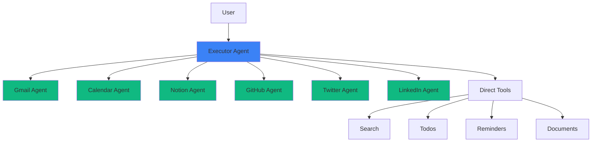

# Agents

GAIA uses a sophisticated multi-agent architecture where specialized AI agents collaborate to handle different aspects of your tasks. Think of it as having a team of experts, each with deep knowledge of specific tools and domains.

## Agent Architecture Overview



<Info>
The Executor Agent is your primary interface. It decides when to handle tasks directly vs. delegating to specialized subagents.
</Info>

## Agent Types

### 1. Executor Agent (Main Agent)

The orchestrator that manages conversations and delegates to specialists.

```python
# From: apps/api/app/agents/core/agent.py:117-161

async def call_agent(
    request: MessageRequestWithHistory,
    conversation_id: str,
    user: dict,
    user_time: datetime,
    user_model_config: Optional[ModelConfig] = None,
) -> AsyncGenerator[str, None]:
    """
    Execute agent in streaming mode for interactive chat.
    
    The executor agent:
    - Maintains conversation context
    - Analyzes user intent
    - Decides on tool usage
    - Delegates to subagents when needed
    - Coordinates multi-step workflows
    """
```

**Responsibilities:**
- Conversation management
- Intent understanding
- Task coordination
- Result synthesis
- User communication

**Available Tools:**
- Search & web browsing
- Document generation
- Todo management
- Reminder creation
- Workflow operations
- Memory search
- Support tickets
- Weather info
- Code execution

### 2. Provider Subagents

Specialized agents for deep integration expertise.

<Tabs>
  <Tab title="Gmail Agent">
    ```python
    # Specialized for email operations
    
    GMAIL_AGENT_CAPABILITIES = {
        "expertise": "Email composition, search, organization",
        "tools": [
            "GMAIL_SEND_MESSAGE",
            "GMAIL_SEARCH_MESSAGES", 
            "GMAIL_CREATE_LABEL",
            "GMAIL_MODIFY_MESSAGE",
            "GMAIL_CREATE_DRAFT",
            # ... 50+ more
        ],
        "special_knowledge": [
            "Email threading and conversation history",
            "Label hierarchy and organization",
            "Advanced search syntax",
            "Attachment handling",
            "HTML email composition"
        ]
    }
    ```
    
    **When to Use:**
    - Sending/receiving emails
    - Complex email searches
    - Email organization
    - Draft management
  </Tab>
  
  <Tab title="Calendar Agent">
    ```python
    CALENDAR_AGENT_CAPABILITIES = {
        "expertise": "Scheduling, time management, availability",
        "tools": [
            "GOOGLECALENDAR_CREATE_EVENT",
            "GOOGLECALENDAR_LIST_EVENTS",
            "GOOGLECALENDAR_FIND_FREE_TIME",
            "GOOGLECALENDAR_UPDATE_EVENT",
            # ... 30+ more
        ],
        "special_knowledge": [
            "Conflict detection",
            "Recurring event patterns",
            "Timezone handling",
            "Attendee management",
            "Resource booking"
        ]
    }
    ```
    
    **When to Use:**
    - Creating/updating events
    - Finding meeting times
    - Managing attendees
    - Calendar queries
  </Tab>
  
  <Tab title="Notion Agent">
    ```python
    NOTION_AGENT_CAPABILITIES = {
        "expertise": "Knowledge management, databases",
        "tools": [
            "NOTION_CREATE_PAGE",
            "NOTION_UPDATE_PAGE",
            "NOTION_QUERY_DATABASE",
            "NOTION_CREATE_DATABASE",
            # ... 40+ more
        ],
        "special_knowledge": [
            "Database schema design",
            "Property types and formulas",
            "Page hierarchies",
            "Block manipulation",
            "Relational database queries"
        ]
    }
    ```
    
    **When to Use:**
    - Creating/updating pages
    - Database operations
    - Knowledge base queries
    - Content organization
  </Tab>
  
  <Tab title="GitHub Agent">
    ```python
    GITHUB_AGENT_CAPABILITIES = {
        "expertise": "Code repositories, issue tracking, CI/CD",
        "tools": [
            "GITHUB_CREATE_ISSUE",
            "GITHUB_CREATE_PR",
            "GITHUB_COMMENT_ON_ISSUE",
            "GITHUB_MERGE_PR",
            "GITHUB_LIST_COMMITS",
            # ... 60+ more
        ],
        "special_knowledge": [
            "Git workflow patterns",
            "Code review processes",
            "Branch management",
            "Issue triage",
            "Release management"
        ]
    }
    ```
    
    **When to Use:**
    - Repository operations
    - Issue/PR management
    - Code reviews
    - Release automation
  </Tab>
</Tabs>

## Agent Communication

### Handoff Pattern

```python
# From: apps/api/app/agents/core/subagents/handoff_tools.py

async def handoff(
    subagent_id: str,     # Which subagent to use
    task: str,            # What they should do
    config: RunnableConfig
) -> str:
    """
    Delegate a task to a specialized subagent.
    
    Example:
    handoff(
        subagent_id="gmail",
        task="Search for emails from boss@company.com in last 7 days"
    )
    
    The subagent:
    1. Receives full context
    2. Uses its specialized tools
    3. Returns results to executor
    """
```

### Communication Flow

<Steps>
  <Step title="User Request">
    "Find my client's email and add their meeting to my calendar"
  </Step>
  
  <Step title="Executor Analysis">
    ```python
    # Executor agent understands this requires:
    # 1. Email search (Gmail subagent)
    # 2. Calendar creation (Calendar subagent)
    
    # Plan execution steps
    steps = [
        {"action": "handoff", "subagent": "gmail", "task": "search"},
        {"action": "handoff", "subagent": "calendar", "task": "create_event"}
    ]
    ```
  </Step>
  
  <Step title="Gmail Subagent Execution">
    ```python
    # Gmail agent receives task
    await gmail_agent.execute(
        task="Search for emails from client@example.com"
    )
    
    # Uses specialized Gmail knowledge
    # Returns: Email thread with meeting details
    ```
  </Step>
  
  <Step title="Calendar Subagent Execution">
    ```python
    # Calendar agent receives task with context
    await calendar_agent.execute(
        task="Create calendar event",
        context={
            "meeting_details": "from gmail agent results",
            "attendees": ["client@example.com"],
            "duration": "30 minutes"
        }
    )
    
    # Returns: Event created successfully
    ```
  </Step>
  
  <Step title="Executor Synthesis">
    ```python
    # Executor combines results
    response = """
    I found the email from your client and created a calendar event:
    
    📧 Email: "Proposal Discussion" from client@example.com
    📅 Event: Tuesday, Dec 17 at 2:00 PM (30 min)
    ✅ Calendar invite sent to client@example.com
    """
    ```
  </Step>
</Steps>

## Agent Graph Architecture

### LangGraph Implementation

```python
# From: apps/api/app/agents/core/graph_builder/build_graph.py

def create_agent(
    llm: LanguageModelLike,
    tool_registry: dict,
    agent_name: str,
    pre_model_hooks: List[Callable],
    end_graph_hooks: List[Callable]
):
    """
    Build an agent graph with:
    - Pre-processing nodes (message filtering, prompt management)
    - LLM execution node
    - Tool execution nodes
    - Post-processing nodes (memory learning, follow-up actions)
    
    Returns compiled StateGraph ready for execution.
    """
```

### Node Pipeline

```python
# From: apps/api/app/agents/core/subagents/base_subagent.py:88-94

# Every agent has this node pipeline:
pre_model_hooks = [
    filter_messages_node,         # Remove irrelevant messages
    manage_system_prompts_node,   # Inject memories & skills
    trim_messages_node,           # Keep context within limits
]

end_graph_hooks = [
    memory_learning_node,         # Learn from execution
    follow_up_actions_node,       # Suggest next steps (main agent only)
]
```

<Accordion title="Node Descriptions">
  <AccordionItem title="filter_messages_node">
    ```python
    # From: apps/api/app/agents/core/nodes/filter_messages.py
    
    async def filter_messages_node(state, config):
        """
        Remove system messages, duplicates, and irrelevant history.
        Keeps conversation focused and within context limits.
        """
    ```
  </AccordionItem>
  
  <AccordionItem title="manage_system_prompts_node">
    ```python
    # From: apps/api/app/agents/core/nodes/manage_system_prompts.py
    
    async def manage_system_prompts_node(state, config):
        """
        Inject:
        - User memories (preferences, contacts)
        - Agent skills (learned procedures)
        - Current datetime
        - Available tools
        """
    ```
  </AccordionItem>
  
  <AccordionItem title="trim_messages_node">
    ```python
    # From: apps/api/app/agents/core/nodes/trim_messages_node.py
    
    async def trim_messages_node(state, config):
        """
        Keep conversation within token limits.
        Uses smart truncation: preserves recent + important messages.
        """
    ```
  </AccordionItem>
  
  <AccordionItem title="memory_learning_node">
    ```python
    # From: apps/api/app/agents/core/nodes/memory_learning_node.py
    
    async def memory_learning_node(state, config):
        """
        After execution:
        1. Extract user memories → mem0
        2. Learn procedural skills → MongoDB
        
        Runs in background, non-blocking.
        """
    ```
  </AccordionItem>
  
  <AccordionItem title="follow_up_actions_node">
    ```python
    # From: apps/api/app/agents/core/nodes/follow_up_actions_node.py
    
    async def follow_up_actions_node(state, config):
        """
        Generate 3-4 contextual suggestions:
        - "Search for related emails"
        - "Create a reminder for follow-up"
        - "Add to this week's agenda"
        
        Only runs for main executor agent.
        """
    ```
  </AccordionItem>
</Accordion>

## State Management

### Agent State

```python
# From: apps/api/app/agents/core/state.py

class State(BaseModel):
    query: str                        # User's current request
    messages: List[AnyMessage]        # Conversation history
    current_datetime: str             # For time-aware operations
    mem0_user_id: str                 # Memory namespace
    memories: List[str]               # Retrieved user memories
    memories_stored: bool             # Tracking flag
    conversation_id: str              # Thread identifier
```

### Checkpointer System

```python
# From: apps/api/app/agents/core/graph_builder/checkpointer_manager.py

class CheckpointerManager:
    """
    Manages PostgreSQL-backed state persistence.
    
    Enables:
    - Resume interrupted conversations
    - Time-travel debugging
    - Branching conversations
    - State recovery after errors
    """
    
    async def get_checkpointer(self):
        """Returns PostgreSQL checkpointer for state storage."""
```

<Info>
Each agent execution creates checkpoints at every node transition. This allows precise state recovery and conversation branching.
</Info>

## Agent Configuration

### Graph Manager

```python
# From: apps/api/app/agents/core/graph_manager.py

class GraphManager:
    """Singleton manager for agent graphs."""
    
    _graphs: Dict[str, CompiledGraph] = {}
    
    @classmethod
    async def get_graph(cls, agent_name: str) -> CompiledGraph:
        """
        Get or create agent graph.
        
        Graphs are compiled once and reused for efficiency.
        Each user execution uses same graph with different config.
        """
```

### Agent Config

```python
# From: apps/api/app/helpers/agent_helpers.py

def build_agent_config(
    conversation_id: str,
    user: dict,
    user_time: datetime,
    user_model_config: Optional[ModelConfig],
    agent_name: str,
) -> dict:
    """
    Build configuration for agent execution.
    
    Config includes:
    - user_id: For memory and permissions
    - thread_id: For conversation tracking
    - user_time: For time-aware operations
    - user_timezone: For scheduling
    - model_config: LLM preferences
    - agent_name: Which agent is executing
    """
```

## Tool Access Patterns

### Tool Registry

```python
# From: apps/api/app/agents/tools/core/registry.py:159-192

class ToolRegistry:
    """Central registry managing all agent tools."""
    
    def _add_category(
        self,
        name: str,              # "gmail"
        tools: List[BaseTool],
        space: str = "general", # Namespace for isolation
        require_integration: bool = False,
        is_delegated: bool = False  # Has subagent?
    ):
        """
        Register a category of tools.
        
        Delegated categories route to subagents.
        Non-delegated categories use direct tool execution.
        """
```

### Tool Retrieval

<Tabs>
  <Tab title="Direct Access">
    ```python
    # Non-delegated tools (todos, reminders, search)
    # Executor agent has direct access
    
    tools = [
        create_todo,
        list_todos,
        create_reminder,
        web_search_tool,
        generate_document
    ]
    
    # Agent can call these directly without handoff
    ```
  </Tab>
  
  <Tab title="Via Subagent">
    ```python
    # Delegated tools (gmail, calendar, notion)
    # Must go through specialized subagent
    
    # ❌ Wrong - executor can't access directly
    await GMAIL_SEND_MESSAGE(to="user@example.com", ...)
    
    # ✅ Correct - handoff to subagent
    await handoff(
        subagent_id="gmail",
        task="Send email to user@example.com"
    )
    ```
  </Tab>
  
  <Tab title="Dynamic Discovery">
    ```python
    # From: apps/api/app/agents/tools/core/retrieval.py
    
    # Agents can discover tools at runtime
    tools = await retrieve_tools(
        query="send slack message",
        user_id=user_id,
        limit=5
    )
    
    # Returns:
    # - SLACK_SEND_MESSAGE
    # - SLACK_SEND_DIRECT_MESSAGE
    # - SLACK_UPDATE_MESSAGE
    # (only if user has Slack connected)
    ```
  </Tab>
</Tabs>

## Agent Prompts

### Specialized System Prompts

```python
# From: apps/api/app/agents/prompts/

# Each subagent has custom prompts
PROMPTS = {
    "gmail_agent": {
        "system": "You are a Gmail expert. You understand email etiquette, ...",
        "skills": "Email composition patterns, threading, ...",
        "examples": "When user says 'email client', search for..."
    },
    
    "calendar_agent": {
        "system": "You are a scheduling expert. You understand availability, ...",
        "skills": "Time conflict resolution, recurring events, ...",
        "examples": "When user says 'next Tuesday', calculate..."
    },
    
    # ... prompts for each subagent
}
```

### Dynamic Prompt Enhancement

```python
# From: apps/api/app/agents/core/nodes/manage_system_prompts.py

async def manage_system_prompts_node(state, config):
    """
    Enhance base prompt with:
    
    1. User Context:
       - Retrieved memories
       - Current datetime
       - User timezone
    
    2. Agent Skills:
       - Learned procedures for this agent
       - Optimal approaches
       - Known gotchas
    
    3. Tool Availability:
       - Connected integrations
       - Available tool list
    """
```

## Agent Execution Modes

### Streaming Execution

```python
# From: apps/api/app/agents/core/agent.py:117-161

async def call_agent(...) -> AsyncGenerator[str, None]:
    """
    Streaming mode for real-time user interactions.
    
    Yields:
    - Intermediate thinking
    - Tool call events
    - Tool results
    - Final response
    - Follow-up suggestions
    
    Used for: Chat interface, voice agents
    """
```

### Silent Execution

```python
# From: apps/api/app/agents/core/agent.py:163-193

async def call_agent_silent(...) -> tuple[str, dict]:
    """
    Silent mode for background processing.
    
    Returns:
    - Complete message
    - Tool usage data
    
    Used for: Workflows, scheduled tasks, webhooks
    """
```

## Performance & Optimization

### Parallel Tool Execution

```python
# Agents can execute independent tools in parallel

# Sequential (slow)
gmail_result = await handoff("gmail", "search emails")
calendar_result = await handoff("calendar", "list events")

# Parallel (fast)
results = await asyncio.gather(
    handoff("gmail", "search emails"),
    handoff("calendar", "list events")
)
```

### Caching

```python
# Tool registry is cached
@cache
async def get_tool_registry() -> ToolRegistry:
    """Singleton registry - built once, used many times."""

# User capabilities are cached
@cache(ttl=300)  # 5 minutes
async def get_user_integration_capabilities(user_id: str):
    """Avoid repeated DB queries for same user."""
```

### Token Optimization

```python
# From: apps/api/app/agents/core/nodes/trim_messages_node.py

async def trim_messages_node(state, config):
    """
    Smart message trimming:
    - Keep system messages (always needed)
    - Keep recent messages (context)
    - Keep tool results (for coherence)
    - Summarize old history (reduce tokens)
    
    Target: Stay under model's context window
    """
```

## Agent Evaluation

### Testing Framework

```python
# From: apps/api/app/agents/evals/

class AgentEvaluator:
    """
    Test agents against benchmark datasets.
    
    For each integration (Gmail, Slack, GitHub):
    - Load test scenarios
    - Execute agent
    - Compare output to expected results
    - Score: correctness, efficiency, safety
    """
    
    async def evaluate_agent(
        agent_name: str,
        test_dataset: str
    ) -> EvaluationReport:
        """Run full evaluation suite."""
```

### Datasets

```json
// From: apps/api/app/agents/evals/datasets/gmail.json

[
  {
    "scenario": "Send email to team",
    "user_input": "Email the team about tomorrow's meeting",
    "expected_tools": ["GMAIL_SEND_MESSAGE"],
    "expected_behavior": "Sends to team distribution list",
    "constraints": ["Must include meeting time", "Professional tone"]
  },
  // ... 50+ test scenarios per integration
]
```

## Best Practices

<CardGroup cols={2}>
  <Card title="Use Specific Subagents" icon="bullseye">
    Let executor delegate to subagents for provider operations. Don't try to access integration tools directly.
  </Card>
  
  <Card title="Provide Context" icon="message">
    When using handoff, include relevant context in the task description:
    
    ```python
    # Good
    handoff("gmail", "Reply to email from boss about Q4 planning meeting")
    
    # Bad
    handoff("gmail", "Reply to email")
    ```
  </Card>
  
  <Card title="Trust Agent Intelligence" icon="brain">
    Agents are smart—don't over-specify. Let them choose the best approach based on learned skills.
  </Card>
  
  <Card title="Monitor Learning" icon="graduation-cap">
    Check agent skill dashboards to see what procedures are being learned and validated.
  </Card>
</CardGroup>

## Debugging Agents

### Conversation Inspection

```typescript
// From: apps/web/src/features/chat/

// Every conversation has full execution trace:
interface ConversationTrace {
  messages: Message[];
  tool_calls: ToolCall[];
  subagent_handoffs: Handoff[];
  state_checkpoints: Checkpoint[];
  memory_updates: MemoryUpdate[];
}

// Inspect exactly what happened at each step
```

### Error Handling

```python
# Agents have robust error handling

try:
    result = await handoff("gmail", task)
except ToolExecutionError as e:
    # Log error, inform user, suggest alternatives
    logger.error(f"Tool execution failed: {e}")
    return "I had trouble with Gmail. Would you like me to try another approach?"

except RateLimitError as e:
    # Automatic retry with backoff
    await asyncio.sleep(e.retry_after)
    result = await handoff("gmail", task)
```

## Related Concepts

- [Integrations](/concepts/integrations) - Tools that agents use
- [Memory System](/concepts/memory-system) - How agents learn
- [Workflows](/concepts/workflows) - Multi-agent orchestration
- [Proactive AI](/concepts/proactive-ai) - Autonomous agent execution

---

**Next Steps:**
- [Explore agent capabilities →](#)
- [View agent learning dashboard →](#)
- [Create custom workflows →](/concepts/workflows)
