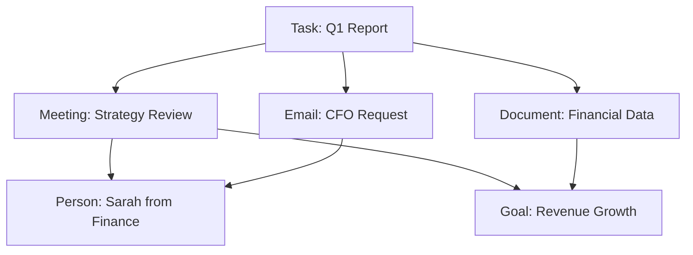

## Core Capabilities

GAIA combines cutting-edge AI with practical automation to transform how you work.

---

## Truly Proactive AI


Unlike traditional assistants that wait for commands, GAIA anticipates your needs and acts ahead of time.

<AccordionGroup>
  <Accordion title="Intelligent Email Monitoring">
    GAIA continuously monitors your inbox and:
    - Flags time-sensitive emails before they become urgent
    - Summarizes important threads automatically
    - Drafts responses based on your communication style
    - Filters out noise and spam proactively
  </Accordion>

  <Accordion title="Smart Deadline Management">
    Never miss a deadline again:
    - Tracks upcoming due dates across all your tools
    - Sends timely reminders with context
    - Suggests task breakdowns for large projects
    - Automatically adjusts priorities based on urgency
  </Accordion>

  <Accordion title="Context-Aware Suggestions">
    GAIA learns your patterns and:
    - Recommends tasks based on your calendar
    - Suggests meeting prep based on attendees
    - Proposes workflow automations for repetitive actions
    - Adapts suggestions to your working style
  </Accordion>
</AccordionGroup>

---

## Automated Workflows


Create sophisticated multi-step workflows that run automatically based on triggers.

### Workflow Components

<CardGroup cols={2}>
  <Card title="Triggers" icon="bolt">
    **When to run:**
    - Time-based (daily, weekly, monthly)
    - Event-based (new email, calendar event)
    - Condition-based (if task is overdue)
    - Manual execution
  </Card>

  <Card title="Actions" icon="wand-magic-sparkles">
    **What to do:**
    - Email operations (send, filter, archive)
    - Calendar management (create, update events)
    - Todo operations (create, complete, update)
    - Data processing (analyze, summarize)
    - Document generation (reports, notes)
    - API calls to external services
  </Card>
</CardGroup>

### Example Workflows

```yaml
# Daily Email Digest
Trigger: Every morning at 8am
Actions:
  1. Fetch unread emails from past 24 hours
  2. Categorize by importance using AI
  3. Generate summary with key action items
  4. Send digest to your inbox
  5. Create todos for urgent items
```

```yaml
# Automatic Meeting Notes
Trigger: After calendar event ends
Actions:
  1. Extract attendees and agenda from event
  2. Generate meeting notes template
  3. Create follow-up todos from action items
  4. Share notes with attendees via email
  5. Link notes to related project
```

```yaml
# Weekly Planning Assistant
Trigger: Every Sunday at 6pm
Actions:
  1. Review completed tasks from past week
  2. Analyze upcoming calendar events
  3. Prioritize pending todos
  4. Generate weekly plan with time blocks
  5. Send planning email with recommendations
```

<Tip>
  Browse hundreds of pre-built workflow templates in the marketplace and customize them to your needs!
</Tip>

---

## Smart Todo Management


Your todos become intelligent mini-workflows that GAIA can execute automatically.

### Todo Features

<Steps>
  <Step title="Intelligent Task Creation">
    Create todos naturally:
    - "Research best project management tools by Friday"
    - "Draft quarterly report with last quarter's metrics"
    - "Schedule coffee chat with new team members"
    
    GAIA automatically:
    - Sets due dates and priorities
    - Adds relevant labels
    - Links to related projects
    - Creates subtasks for complex items
  </Step>

  <Step title="Automated Execution">
    For research and drafting tasks, GAIA can:
    - Conduct web research automatically
    - Compile findings and sources
    - Generate initial drafts
    - Attach relevant documents
    - Update you with progress
  </Step>

  <Step title="Context & Memory">
    Every todo is enriched with context:
    - Links to related emails and calendar events
    - Connected to project goals
    - Includes conversation history
    - Remembers your preferences and style
  </Step>
</Steps>

---

## Unified Productivity Hub


One dashboard that brings together everything you need to understand your day.

<CardGroup cols={2}>
  <Card title="Chat Interface" icon="comments">
    Natural conversation with GAIA:
    - Ask questions about your schedule
    - Request task summaries
    - Draft emails and documents
    - Get instant answers
  </Card>

  <Card title="Todo View" icon="list-check">
    All your tasks in one place:
    - Grouped by project and priority
    - Smart filtering and search
    - Quick actions and batch operations
    - Progress tracking
  </Card>

  <Card title="Calendar Integration" icon="calendar">
    Your schedule at a glance:
    - All calendars unified
    - Meeting prep suggestions
    - Time blocking recommendations
    - Conflict detection
  </Card>

  <Card title="Email Management" icon="envelope">
    Inbox zero made easy:
    - AI-powered categorization
    - Quick actions (archive, reply, snooze)
    - Thread summaries
    - Smart filters
  </Card>
</CardGroup>

---

## Graph-Based Memory


GAIA builds a living knowledge graph that connects all aspects of your work.

### How It Works

The knowledge graph creates relationships between:



<Note>
  **Everything connects:** Tasks link to projects, meetings link to documents, emails link to people and goals. GAIA understands the full context of your work.
</Note>

### Memory Features

- **Long-term Context**: Remembers conversations and decisions from months ago
- **Skill Learning**: Learns your communication style and preferences over time
- **Profile Building**: Automatically builds profiles of people you interact with
- **Project Context**: Maintains complete history of each project
- **Smart Retrieval**: Surfaces relevant context when you need it

---

## Integration Marketplace


Connect GAIA with hundreds of tools and services.

### Popular Integrations

<CardGroup cols={3}>
  <Card title="Gmail" icon="envelope">
    Email automation and management
  </Card>
  <Card title="Google Calendar" icon="calendar">
    Schedule and event management
  </Card>
  <Card title="Notion" icon="book">
    Notes and document management
  </Card>
  <Card title="Slack" icon="slack">
    Team communication
  </Card>
  <Card title="Linear" icon="chart-line">
    Issue tracking
  </Card>
  <Card title="GitHub" icon="github">
    Code repository management
  </Card>
  <Card title="Google Docs" icon="file-alt">
    Document creation
  </Card>
  <Card title="Google Sheets" icon="table">
    Spreadsheet automation
  </Card>
  <Card title="LinkedIn" icon="linkedin">
    Professional networking
  </Card>
</CardGroup>

### Available Tools

GAIA includes built-in tools for:

- **Calendar Operations**: Create, update, and manage events across calendars
- **Email Management**: Send, filter, and organize emails intelligently  
- **Document Processing**: Read, write, and summarize documents
- **Web Research**: Fetch and analyze web content
- **Code Execution**: Run Python code for data processing
- **Image Generation**: Create images using AI models
- **Weather Data**: Get weather forecasts and conditions
- **Reminders**: Set and manage reminders
- **Notes**: Create and organize notes
- **Goal Tracking**: Set and monitor personal goals

<Tip>
  Can't find an integration? GAIA supports custom tool development - build your own integrations with our SDK!
</Tip>

---

## Multi-Platform Access

Access GAIA from anywhere, on any device.

<Tabs>
  <Tab title="Web">
    Full-featured web application:
    - Works in any modern browser
    - No installation required
    - Syncs across devices
    - Responsive design
    
    Access at [heygaia.io](https://heygaia.io)
  </Tab>

  <Tab title="Desktop">
    Native desktop apps for:
    - **macOS** (Intel & Apple Silicon)
    - **Windows** (Windows 10+)
    - **Linux** (Ubuntu, Fedora, Arch)
    
    Features:
    - Native notifications
    - System tray integration
    - Keyboard shortcuts
    - Offline mode (coming soon)
  </Tab>

  <Tab title="Mobile">
    Mobile apps for:
    - **iOS** (coming soon)
    - **Android** (coming soon)
    
    Features:
    - Push notifications
    - Voice commands
    - Quick actions
    - Widget support
  </Tab>
</Tabs>

---

## Developer Features

Built with developers in mind.

<CardGroup cols={2}>
  <Card title="REST API" icon="code">
    Full-featured REST API:
    - OpenAPI documentation
    - Authentication with OAuth2
    - Rate limiting
    - Webhooks
  </Card>

  <Card title="WebSocket Support" icon="plug">
    Real-time communication:
    - Live updates
    - Streaming responses
    - Event notifications
  </Card>

  <Card title="Custom Tools" icon="hammer">
    Build your own integrations:
    - Python-based tool system
    - Type-safe with Pydantic
    - Hot reloading in dev mode
  </Card>

  <Card title="Open Source" icon="github">
    Full transparency:
    - Source code available
    - Community contributions
    - Regular updates
  </Card>
</CardGroup>

---

## Security & Privacy

Your data security is our top priority.

- **End-to-End Encryption**: All data encrypted in transit and at rest
- **OAuth2 Authentication**: Industry-standard authentication
- **Self-Hosting Option**: Complete control over your data
- **Data Export**: Download all your data anytime
- **Audit Logs**: Track all access and changes
- **GDPR Compliant**: Full compliance with privacy regulations

<Warning>
  When self-hosting, you are responsible for securing your infrastructure and managing API keys.
</Warning>

---

## What's Next?

<CardGroup cols={2}>
  <Card
    title="See Use Cases"
    icon="lightbulb"
    href="/use-cases"
  >
    Learn how to apply these features
  </Card>
  <Card
    title="Get Started"
    icon="rocket"
    href="/quickstart"
  >
    Start using GAIA today
  </Card>
</CardGroup>